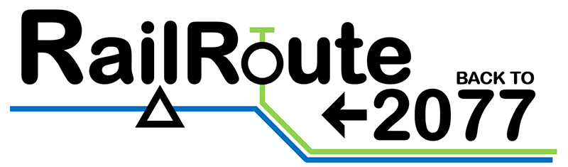
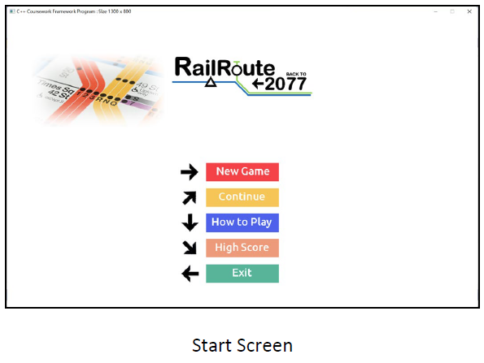
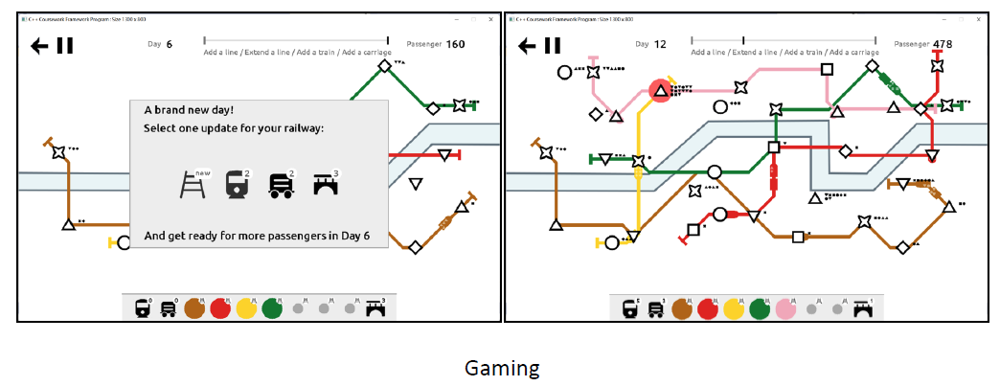
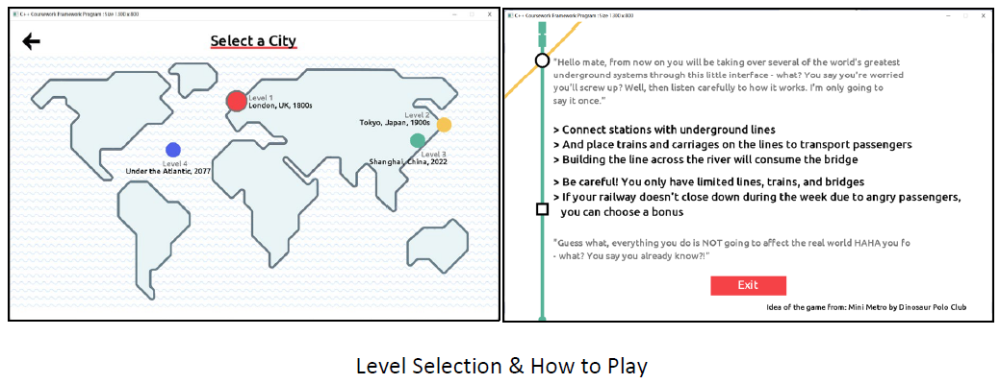
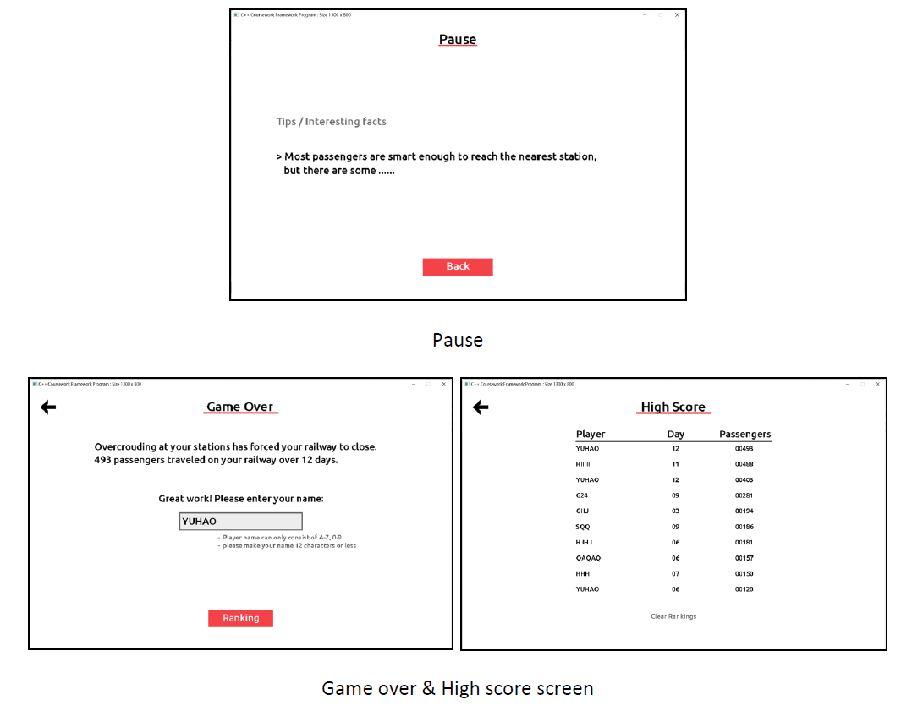

## RailRoute <- (back to) 2077

#### by Yuhao Zhang, 2122SPR @ UoN

- A stratage game that allows the user to respond to the increasing demand for passenger transportation by arranging and assigning railway lines and trains so that the city does not become overcrowded
- IDE used for this project: VS2019

#### Acknowledgment
- Coursework Framework by [Dr. Jason Atkin](http://www.cs.nott.ac.uk/~pszja/) (Module convenor of COMP2006 CPP)
- Idea from **MiniMetro** by _Dinosaur Polo Club_ released at 06/11/2015 (on [Steam](https://store.steampowered.com/app/287980/Mini_Metro/); on [Apple Arcade](https://apps.apple.com/us/app/mini-metro/id1550663539))
- Note: this is not for commercial use

#### Screenshots of gameplay

